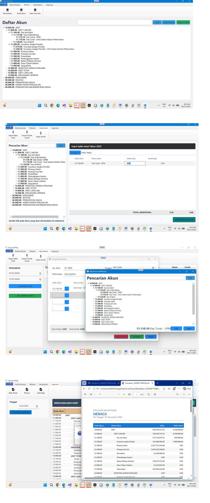

# General Ledger Application (.NET 8 / WPF / MVVM)

## 📌 Project Overview
A robust desktop-based **General Ledger (GL)** accounting system designed to streamline financial record-keeping, journal entries, and core ledger operations.

---

## 📚 Key Accounting Terminology
To maintain clarity in the application interface and reporting, the following standard terms are used throughout the project:

* **Akun** $\rightarrow$ **Account Code** (Core structure for charting accounts)
* **Neraca** $\rightarrow$ **Balance Sheet** (Financial position report generated via QuestPDF)
* **Laba Rugi** $\rightarrow$ **Income Statement / Profit & Loss (P&L)** (Financial performance report)

---

## 🛠️ Technology Stack
* **Framework:** .NET 8, WPF (Windows Presentation Foundation)
* **Architecture:** MVVM (Model-View-ViewModel)
* **Data Access:** Dapper (High-performance micro-ORM)
* **Reporting:** QuestPDF
* **Database:** SQLite (Flexible and designed with database-agnostic architecture)
   ### ⚙️ Project Structure
1. **Domain:**
   * Contains classes representing database tables.
   * Passed to the repository to form relations with the database.

2. **Repository:**
   * Contains classes for all database operations. All database interactions go through these classes.
   * Provides interfaces for access from the Services layer.

3. **Services:**
   * Acts as a bridge between repositories and the UI.
   * Provides interfaces for access from the views.

4. **View Model **
*The bridge or intermediary between the View (the UI/User Interface) and the Model (the data and business logic).

*It is responsible for handling the application's presentation logic, managing state, and preparing data in Services so that it can be easily displayed and updated on the View.
5. **DTO**
   * Representation  the need of User Interface to Data format, Services will convert it to Domain (class) and then to Repository .
     

6. **View Presentation:**
XAML (Extensible Application Markup Language) is a declarative XML-based language developed by Microsoft. It is used to initialize instances of objects and properties, and it is primarily utilized in WPF (Windows Presentation Foundation), UWP, and WinUI to design user interfaces (UI).

