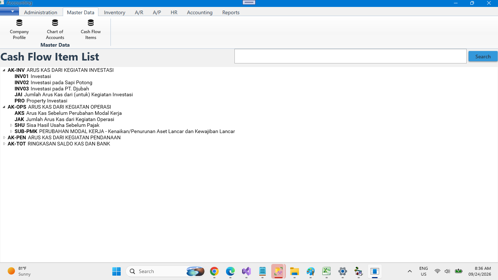
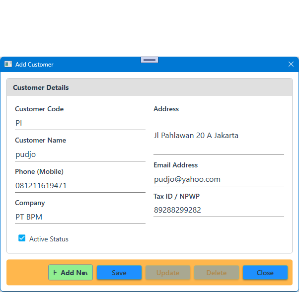
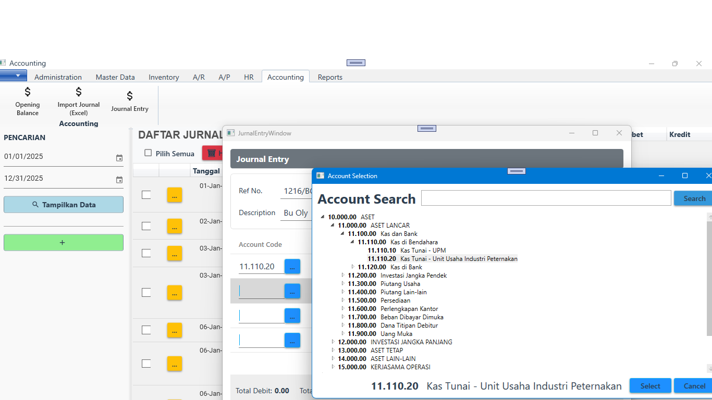
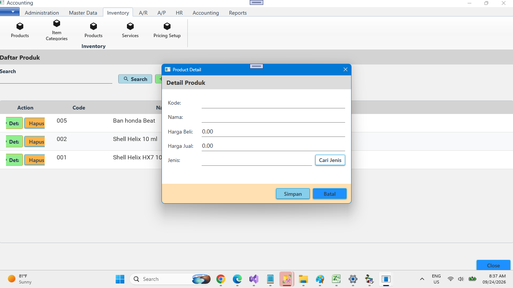
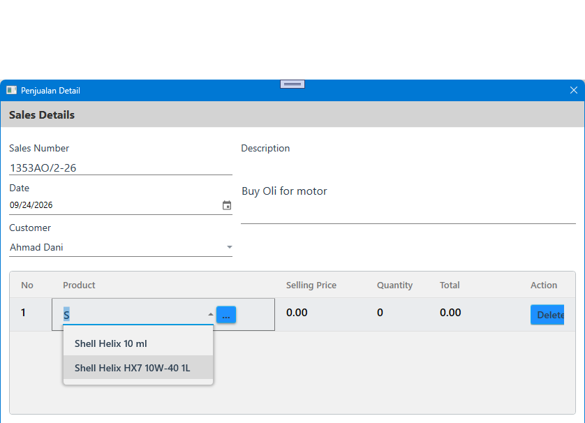
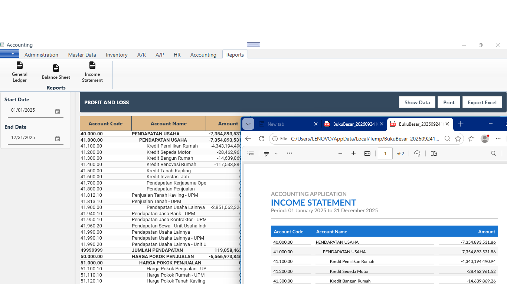

# General Ledger Application (.NET 8 / WPF / MVVM)

## 📌 Project Overview
A robust desktop-based **General Ledger (GL)** accounting system designed to streamline financial record-keeping, journal entries, and core ledger operations.

---


## 🛠️ Technology Stack
* **Framework:** .NET 8, WPF (Windows Presentation Foundation)
* **Architecture:** MVVM (Model-View-ViewModel)
* **Data Access:** Dapper (High-performance micro-ORM)
* **Reporting:** QuestPDF
* **Database:** SQLite (Flexible and designed with database-agnostic architecture)
# Architecture & SOLID Principles

This repository implements a clean, layered software architecture consisting of **UI, Service, Repository, and Domain/DTO layers**. The design strictly adheres to the **SOLID principles** to ensure a modular, testable, and maintainable codebase.

---

## 🏗️ Layered Architecture Overview

* **UI Layer**: Responsible solely for presentation, rendering data, and capturing user interactions. Contains no business logic or database queries.
* **Service Layer**: Handles core **business logic**, validation rules, and workflow orchestration, remaining entirely agnostic of data persistence mechanisms.
* **Repository Layer**: Dedicated exclusively to **data access**, executing queries, and communicating with databases via ORMs or micro-ORMs (e.g., Dapper/Entity Framework).
* **Domain / DTO Layer**: Domain models encapsulate core business rules and entities, while DTOs (*Data Transfer Objects*) act as lightweight data containers for transferring information across layers.

---

## 📐 With MVVM, This application is Applying SOLID Principles

### 1. S - Single Responsibility Principle (SRP)
* *A class or module should have one, and only one, reason to change.*
* Each layer has a distinct, isolated responsibility. For instance, the UI does not handle data queries, and the Repository does not execute business validation.

### 2. O - Open/Closed Principle (OCP)
* *Software entities should be open for extension, but closed for modification.*
* By depending on abstractions (such as repository interfaces), switching or adding data sources (e.g., swapping SQL Server for PostgreSQL) can be done by extending new implementations without modifying the core Service Layer.

### 3. L - Liskov Substitution Principle (LSP)
* *Objects in a program should be replaceable with instances of their subtypes without altering the correctness of that program.*
* Any concrete repository implementation (e.g., `SqlRepository<T>` or an `InMemoryRepository<T>` used for unit testing) can seamlessly replace another via its interface without breaking the service layer.

### 4. I - Interface Segregation Principle (ISP)
* *Clients should not be forced to depend upon interfaces that they do not use.*
* Interfaces are kept granular and focused (e.g., separating read operations from write operations) so consumers only depend on the exact capabilities they need.

### 5. D - Dependency Inversion Principle (DIP)
* *High-level modules should not depend on low-level modules; both should depend on abstractions.*
* The high-level Service Layer never directly instantiates low-level repositories using the `new` keyword. Instead, dependencies are injected via interfaces using **Dependency Injection (DI)**:

```csharp
public class UserService {
    private readonly IUserRepository _repository;

    // Depends on the abstraction (Interface), not a concrete implementation
    public UserService(IUserRepository repository) {
        _repository = repository;
    }
}
   ### ⚙️ Project Structure
1. **Domain:**
   * Contains classes representing database tables.
   * Passed to the repository to form relations with the database.

2. **Repository:**
   * Contains classes for all database operations. All database interactions go through these classes.
   * Provides interfaces for access from the Services layer.

3. **Services:**
   * Acts as a bridge between repositories and the UI.
   * Provides interfaces for access from the views.

4. **View Model **
*The bridge or intermediary between the View (the UI/User Interface) and the Model (the data and business logic).

*It is responsible for handling the application's presentation logic, managing state, and preparing data in Services so that it can be easily displayed and updated on the View.
5. **DTO**
   * Representation  the need of User Interface to Data format, Services will convert it to Domain (class) and then to Repository .
     

6. **View Presentation:**
XAML (Extensible Application Markup Language) is a declarative XML-based language developed by Microsoft. It is used to initialize instances of objects and properties, and it is primarily utilized in WPF (Windows Presentation Foundation), UWP, and WinUI to design user interfaces (UI).


📸 Application ScreenshotsHere 
are some previews of the application features and interfaces:Feature / InterfaceScreenshot
Cash Flow
Customer Management
Opening Balance Input
Journal Entry
Product Management
Excel Import
Sales (Selling)
Balance Sheet Report
Profit & Loss Report


(import%20Excell.png)Sales (Selling)Balance Sheet ReportProfit & Loss Report
